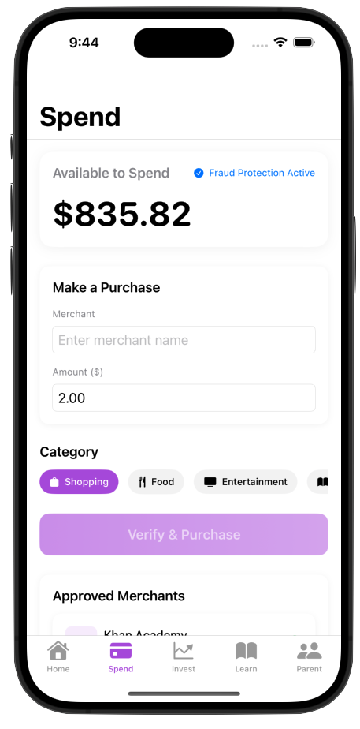
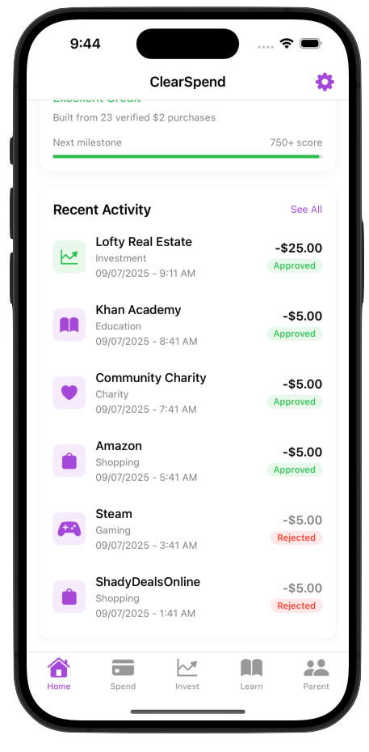
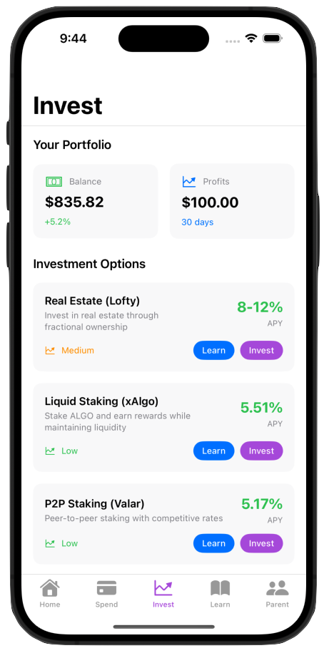
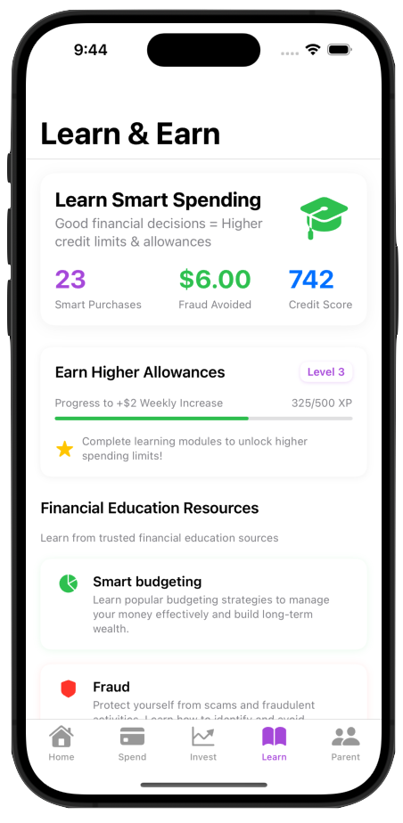
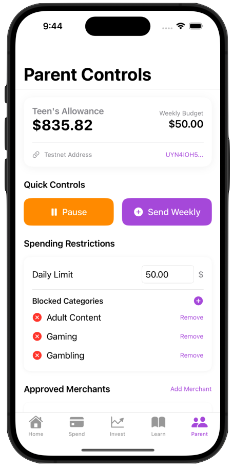
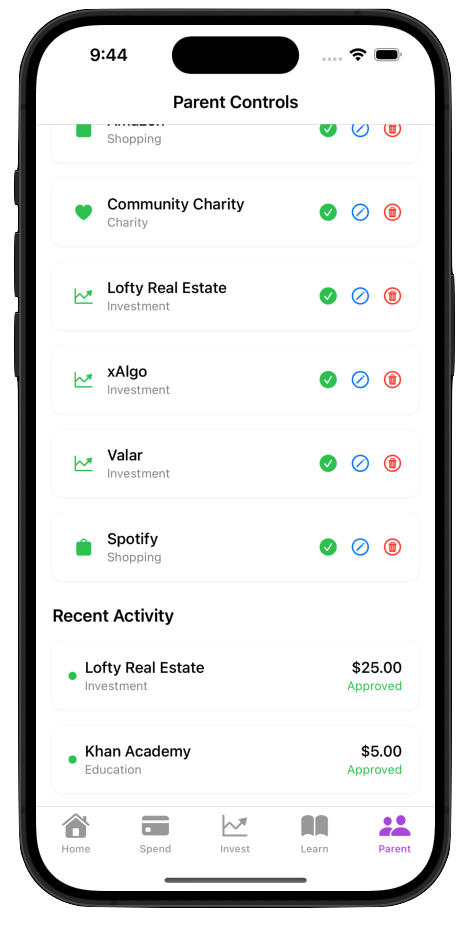
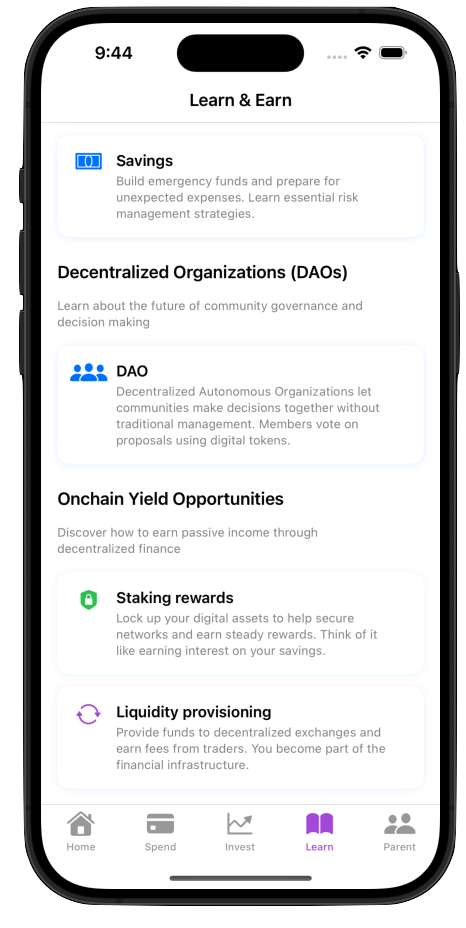

# ClearSpend - Teen Financial Literacy on Algorand (WINNERS $10k) ⭐⭐⭐

## Algorand x EasyA Harvard Hackathon 

ClearSpend is a blockchain-powered teen spending app that teaches financial responsibility through verifiable, parent-controlled digital allowances on Algorand.

## Problem Statement

Teens lack transparent, educational tools for managing money digitally while parents struggle to monitor and guide spending habits effectively. Traditional teen debit cards offer limited controls and no verifiable spending history for building credit reputation.

## Our Solution

ClearSpend leverages Algorand's atomic transfers and smart contracts to create a trustless system where:
- **Every purchase is pre-verified** before money moves
- **Parents set smart controls** via on-chain attestations
- **Teens build verifiable spending history** for future credit
- **Educational gamification** teaches financial literacy

## Key Features

### Core Hackathon Features (MVP)
- **ASA-based Allowances**: Weekly allowances issued as Algorand Standard Assets
- **Atomic Transfer Verification**: Purchases verified through atomic groups before execution
- **On-chain Attestation**: Oracle-based merchant/category verification via box storage
- **iOS Demo App**: Native SwiftUI app with teen-focused UX


*Smart purchase flow with real-time merchant verification*

### Smart Contract Architecture
1. **Attestation Oracle Contract** (`attestation_oracle.py`)
   - Merchant approval attestations in box storage
   - Category restrictions and daily limits
   - Real-time purchase verification

2. **Allowance Manager Contract** (`allowance_manager.py`)
   - Parent-controlled allowance issuance
   - Timelock savings functionality
   - Pause/resume capabilities

### Atomic Transfer Flow
```
1. App Call → Check attestation exists
2. App Call → Verify spending limits
3. ASA Transfer → Execute only if approved
```

## How It Works

### System Architecture Overview

ClearSpend operates on a three-layer architecture that ensures secure, verifiable transactions while maintaining educational value for teens:

```
┌─────────────────┐    ┌─────────────────┐    ┌──────────────────┐
│   iOS App       │    │   Backend API   │    │   Algorand       │
│   (Teen UI)     │◄──►│   (FastAPI)     │◄──►│   Blockchain     │
│                 │    │                 │    │                  │
│ • Spend View    │    │ • Oracle Service│    │ • Smart Contracts│
│ • Home View     │    │ • Blockchain    │    │ • ASA Transfers  │
│ • Learn View    │    │   Service       │    │ • Box Storage    │
└─────────────────┘    └─────────────────┘    └──────────────────┘
```

#### App Interface Preview

*Home screen showing balance, recent transactions, and quick actions*

### 1. **Parent Setup & Allowance Management**

**Initial Setup:**
- Parent creates Algorand wallet and deploys smart contracts
- Parent configures spending rules via the Attestation Oracle
- Parent issues weekly allowance as ASA (Algorand Standard Asset)

**Allowance Manager Contract:**
```python
# Parent sets up allowance with restrictions
allowance_manager.create_allowance(
    teen_address="TEEN_WALLET_ADDRESS",
    weekly_amount=100000000,  # 100 ALGO
    categories=["Food", "Entertainment", "Education"],
    daily_limit=50000000     # 50 ALGO per day
)
```

### 2. **Merchant Verification System**

**Oracle Service:**
- Maintains a database of approved merchants and categories
- Stores attestations in Algorand Box Storage for scalability
- Real-time verification of purchase requests

**Merchant Attestation Process:**
```python
# Oracle verifies merchant before purchase
attestation = {
    "merchant_name": "Starbucks",
    "category": "Food & Beverage", 
    "is_approved": True,
    "daily_limit": 50000000,
    "parent_approved": True
}
```

### 3. **Purchase Flow & Verification**

**Step-by-Step Purchase Process:**

1. **Teen Initiates Purchase** (iOS App)
   - Selects merchant from approved list
   - Enters purchase amount
   - App calls backend API for verification

2. **Backend Verification** (FastAPI)
   - Checks merchant attestation in Oracle
   - Verifies spending limits and category restrictions
   - Validates teen's current balance

3. **Atomic Transfer Execution** (Algorand)
   - Creates atomic transfer group with 3 transactions:
     - App Call: Verify attestation exists
     - App Call: Check spending limits
     - ASA Transfer: Execute payment (only if both checks pass)

4. **Transaction Confirmation**
   - Success: Teen receives confirmation with Algorand Explorer link
   - Failure: Clear feedback on why purchase was rejected

### 4. **Smart Contract Logic**

**Attestation Oracle Contract:**
```python
def verify_purchase(merchant_name, amount, teen_address):
    # Check if merchant is approved
    attestation = get_attestation(merchant_name)
    if not attestation.is_approved:
        return False
    
    # Check daily spending limit
    daily_spent = get_daily_spent(teen_address, merchant_name)
    if daily_spent + amount > attestation.daily_limit:
        return False
    
    # Check category restrictions
    if not is_category_allowed(attestation.category, teen_address):
        return False
    
    return True
```

**Allowance Manager Contract:**
```python
def issue_allowance(teen_address, amount):
    # Check if parent has sufficient balance
    if get_parent_balance() < amount:
        return False
    
    # Issue ASA to teen
    transfer_asa(teen_address, amount)
    
    # Update allowance tracking
    update_allowance_history(teen_address, amount)
    
    return True
```

### 5. **Educational Components**

**Gamification System:**
- Teens earn XP for completing financial education modules
- Spending history builds verifiable credit reputation
- Parent-approved categories teach responsible spending

**Learning Modules:**
- Budgeting basics and expense tracking
- Understanding interest rates and savings
- Introduction to investment concepts
- Credit building and financial responsibility

### 6. **Security & Trust Model**

**Trustless Verification:**
- All transactions are verified on-chain before execution
- Parents can't retroactively change rules (immutable smart contracts)
- Teens can't spend more than allowed (atomic transfer groups)

**Transparency:**
- All transactions are publicly verifiable on Algorand Explorer
- Spending history is immutable and auditable
- Parents can monitor but not interfere with approved transactions

### 7. **Technical Implementation Details**

**Backend Services:**
- **Blockchain Service**: Handles Algorand SDK interactions
- **Oracle Service**: Manages merchant attestations and verification
- **API Routes**: RESTful endpoints for iOS app integration

**iOS App Architecture:**
- **SwiftUI**: Modern, declarative UI framework
- **AlgorandService**: Handles blockchain interactions
- **MerchantService**: Manages merchant data and verification
- **WalletViewModel**: Business logic and state management

**Data Flow:**
```
iOS App → FastAPI Backend → Algorand Smart Contracts → Box Storage
   ↑                                                           ↓
   └─────────────── Transaction Confirmation ←─────────────────┘
```

### 8. **Real-World Integration**

**Merchant Onboarding:**
- Merchants can register through the Oracle Service
- Parent approval required for new merchant categories
- Real-time merchant database updates

**Payment Processing:**
- Uses Algorand's low fees for micro-transactions
- Atomic transfers ensure payment security
- Instant settlement and confirmation

This architecture ensures that ClearSpend provides a secure, educational, and transparent platform for teen financial management while leveraging Algorand's unique blockchain capabilities.

## iOS App Features

### Teen View

#### Home Screen - Balance & Recent Activity


- **Home**: Balance display, recent transactions, quick actions
- Real-time balance updates with Algorand integration
- Transaction history with explorer links

#### Spend Tab - Smart Purchase Flow


- **Spend**: Smart purchase flow with category selection
- Merchant verification through backend API
- Real-time purchase approval/rejection

#### Invest Tab - Financial Education


- **Invest**: Introduction to saving and investment concepts
- Educational content about financial responsibility
- Investment tracking and portfolio management

#### Learn Tab - Gamified Education


- **Learn**: Gamified financial education modules
- Interactive lessons on budgeting and saving
- Progress tracking and achievement system

### Parent Control Features

#### Parent Dashboard


- **Parent Controls**: Set spending limits and merchant restrictions
- **Category Management**: Approve/deny spending categories
- **Real-time Monitoring**: Track teen spending activity

#### Parent Settings


- **Allowance Management**: Set weekly/monthly allowances
- **Merchant Approval**: Control which merchants are allowed
- **Spending Limits**: Set daily and per-transaction limits

### Technical Implementation
- SwiftUI for modern iOS UI
- Algorand SDK integration for blockchain interaction
- Backend API integration for real-time verification
- Real-time balance updates

## Technology Stack

- **Blockchain**: Algorand (Testnet)
- **Smart Contracts**: PyTeal/Algorand Python
- **iOS**: Swift, SwiftUI
- **Features Used**:
  - ASAs (Algorand Standard Assets)
  - Atomic Transfers
  - Box Storage
  - Smart Contract App Calls

## Project Structure

```
clear-spend/
├── backend/                    # Backend API & Services
│   ├── contracts/             # AlgoKit smart contracts
│   │   ├── attestation_oracle.py
│   │   └── allowance_manager.py
│   ├── services/              # Core business logic
│   │   ├── blockchain_service.py
│   │   └── oracle_service.py
│   ├── api/                   # FastAPI endpoints
│   │   ├── routes/            # API routes
│   │   └── models/            # Request/Response models
│   ├── tests/                 # Comprehensive testing
│   ├── deployment/            # Docker & deployment configs
│   └── main.py                # FastAPI application
├── ClearSpend/                # iOS SwiftUI app source code
│   ├── Views/                 # SwiftUI views
│   ├── Models/                # Data models
│   ├── Services/              # Algorand integration
│   ├── ViewModels/            # Business logic
│   └── Assets.xcassets/       # App assets and resources
├── ClearSpend.xcodeproj/      # Xcode project file
├── docs/                      # Documentation
│   ├── ARCHITECTURE.md        # System architecture
│   ├── API.md                 # API documentation
│   └── config.env.example     # Environment template
├── scripts/                   # Utility scripts
│   ├── setup.sh              # Project setup script
│   ├── start_backend.py      # Backend startup script
│   ├── test_integration.py   # Integration tests
│   ├── demo_backend_integration.py # Demo script
│   └── utilities/            # Utility scripts
│       ├── create_clearspend_asa.py
│       └── generate_testnet_wallet.py
├── Makefile                   # Build automation
├── .gitignore                 # Git ignore rules
└── requirements.txt           # Python dependencies
```

## Getting Started

### Prerequisites
- Python 3.11+
- Xcode 15+
- iOS 17+
- Algorand Testnet account
- AlgoKit installed (`pipx install algokit`)

### Quick Setup
```bash
# Clone repository
git clone https://github.com/yourteam/clearspend.git
cd clear-spend

# Run automated setup
./scripts/setup.sh

# Start the backend
make backend
```

### Manual Setup
```bash
# Install dependencies
make install

# Configure environment
cp docs/config.env.example docs/config.env
# Edit docs/config.env with your Algorand credentials

# Deploy smart contracts
make deploy

# Start the backend API
make backend
```

### iOS App Setup
```bash
# Open in Xcode
open ClearSpend.xcodeproj

# Build and run on simulator
make ios
```

### Available Commands
```bash
make help          # Show all available commands
make install       # Install dependencies
make backend       # Start backend API
make ios          # Build iOS app (requires Xcode)
make test         # Run all tests
make deploy       # Deploy smart contracts
make docker       # Run with Docker Compose
make clean        # Clean temporary files
```

## Demo Flow

### Backend API Flow
1. **Start Backend** → API running on `http://localhost:8000`
2. **Deploy Contracts** → Smart contracts deployed to Algorand Testnet
3. **Add Merchants** → Oracle service manages merchant attestations
4. **Verify Purchases** → Real-time purchase verification via API
5. **Execute Transactions** → Atomic transfer groups for secure purchases

### iOS App Flow


1. **Teen opens app** → Sees $1000 allowance (10 ALGO at $100/ALGO rate)
2. **Initiates purchase** → Selects merchant and amount
3. **API Verification** → Backend verifies purchase via atomic transfers
4. **Approved purchases** → Instant confirmation with explorer link
5. **Rejected purchases** → Clear feedback on restrictions
6. **Learning rewards** → Earn XP for financial education

## Why We Win

### Innovation
- First teen finance app with **pre-purchase blockchain verification**
- Novel use of atomic transfers for parental controls

### Algorand Utilization
- Leverages unique Algorand features:
  - Atomic transfers for trustless verification
  - Box storage for scalable attestations
  - Low fees enabling micro-transactions

### Impact
- Addresses real need for teen financial education
- Builds on-chain credit history from young age
- Reduces financial fraud and overspending

### Feasibility
- Working MVP in 36 hours
- Clear path to production
- Minimal infrastructure requirements

## Team

**Ellis Osborn** - Wharton '26, founder of Fitcentive

**Maggie Schwierking** - Wharton & CS '26

## License

MIT License - Open source for the community

## Links

- [Demo Video](https://drive.google.com/file/d/1uYmhTeyYJPIr0KVKu4QANZ0HwwCpz-8X/view?usp=sharing)
- [Full Project Walkthrough](https://drive.google.com/file/d/1AM0P9OGZea-J7We3JQHX2HNeu7gMYE4V/view?usp=sharing)
- [Presentation Slides](https://www.canva.com/design/DAGyRYsD7ss/fk-b71lykyxVjLpjrMdjrg/edit?utm_content=DAGyRYsD7ss&utm_campaign=designshare&utm_medium=link2&utm_source=sharebutton)
- [Algorand Explorer](https://testnet.algoexplorer.io)

---

Built at Algorand x EasyA Harvard Hackathon 2025
