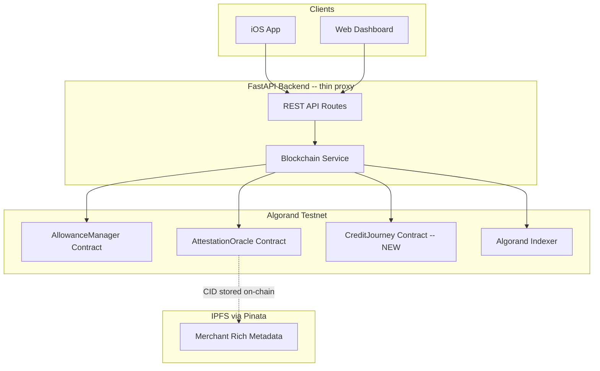
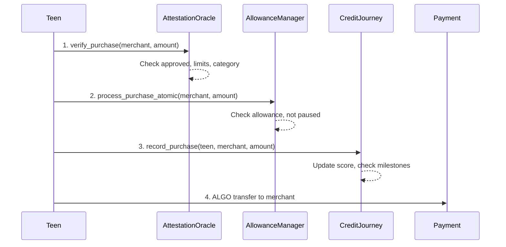

# Fully On-Chain ClearSpend Architecture

> Eliminate the database layer entirely and move all persistent state on-chain via Algorand smart contracts. Add a new CreditJourney contract for gamification, enhance existing contracts, rewire the FastAPI backend as a thin read/write proxy to Algorand, and connect the frontend to real data.

## Architecture Overview



**Core principle:** The blockchain is the database. The FastAPI backend is a stateless proxy that reads from Algorand (via algod/indexer) and builds transactions for clients to sign. No Postgres, no Redis, no SQLAlchemy.

---

## 1. Smart Contract Changes

### 1a. AllowanceManager -- minor enhancements

File: `backend/contracts/allowance_manager.py`

The contract already stores `parent` and `teen` addresses, which serves as implicit user registration. Creating an allowance contract IS signing up. Auth is native Algorand -- every transaction is signed by a wallet, and the contract already asserts `Txn.sender == self.parent.native` or `self.teen.native`.

**Add:**
- A `role_of(address)` readonly method that returns `"parent"`, `"teen"`, or `"none"` -- useful for the frontend to determine which UI to show
- An `is_active` global state flag so the backend can quickly check if a contract instance is live

No structural changes needed -- the existing design already handles user identity correctly.

### 1b. AttestationOracle -- add IPFS metadata support

File: `backend/contracts/attestation_oracle.py`

The `MerchantAttestation` struct currently stores `merchant_name`, `category`, `is_approved`, `daily_limit`, `total_spent_today`, `last_update`, `parent_approved`.

**Add an `ipfs_cid` field** to `MerchantAttestation`:
```python
class MerchantAttestation(Struct):
    merchant_name: String
    category: String
    is_approved: Bool
    daily_limit: UInt64
    total_spent_today: UInt64
    last_update: UInt64
    parent_approved: Bool
    metadata_cid: String  # IPFS CID pointing to rich metadata (logo, description, address, etc.)
```

The CID points to a JSON file on Pinata IPFS containing the rich merchant info (logo URL, full description, physical address, reputation score, etc.) that would be too expensive to store on-chain. The on-chain data stays lean -- just what the contract logic needs for verification.

### 1c. NEW: CreditJourney Contract

New file: `backend/contracts/credit_journey.py`

This contract tracks gamification state per teen. Uses box storage keyed by teen address.

**Data structures:**
```python
class TeenCreditProfile(Struct):
    teen_address: Address
    credit_score: UInt64          # 300-850
    total_xp: UInt64
    spending_consistency: UInt64  # 0-100 score
    savings_rate: UInt64          # 0-100 score
    merchant_diversity: UInt64    # 0-100 score
    total_purchases: UInt64
    unique_merchants: UInt64
    current_streak_weeks: UInt64
    longest_streak_weeks: UInt64
    last_activity: UInt64

class MilestoneRecord(Struct):
    milestone_id: String
    achieved: Bool
    achieved_date: UInt64
    progress: UInt64
    target: UInt64
    xp_awarded: UInt64
```

**Key methods:**
- `initialize(allowance_app_id, attestation_app_id)` -- links to the other two contracts
- `register_teen(teen_address)` -- creates a box with initial credit profile (score 300)
- `record_purchase(teen_address, merchant_name, amount)` -- called after a successful purchase atomic group; updates purchase count, unique merchants, recalculates sub-scores, checks milestones
- `record_savings_lock(teen_address, amount)` -- called when teen locks savings; boosts savings_rate score
- `update_streak(teen_address)` -- called weekly; increments or resets the spending streak
- `get_credit_profile(teen_address)` readonly -- returns the full profile
- `get_milestones(teen_address)` readonly -- returns milestone progress
- `calculate_credit_score(teen_address)` -- weighted formula:
  - Spending consistency: 35%
  - Savings rate: 30%
  - Merchant diversity: 25%
  - Streak bonus: 10%

**Who can call what:**
- `record_purchase` and `record_savings_lock` should only be callable by the AllowanceManager contract (inner transaction or verified via atomic group) to prevent fake score inflation
- `get_*` methods are readonly, anyone can call
- `update_streak` can be called by anyone (it just checks timestamps)

### 1d. Updated Atomic Purchase Flow

The atomic group grows from 3 to 4 transactions:



Update `AllowanceManager.process_purchase_atomic` to expect `Global.group_size == 4` instead of 3.

---

## 2. Backend Changes

### 2a. Strip database dependencies

- Remove `sqlalchemy`, `asyncpg`, `redis` from `backend/requirements.txt` and root `requirements.txt`
- Remove Postgres and Redis services from `backend/deployment/docker-compose.yml`
- Add `pinata-sdk` or use `httpx` to call Pinata API for IPFS uploads

### 2b. Enhance blockchain_service.py

File: `backend/services/blockchain_service.py`

This becomes the core data layer. Add methods to:
- Read teen credit profiles from CreditJourney contract boxes
- Read merchant attestations from AttestationOracle boxes
- Fetch transaction history from Algorand Indexer
- Build atomic transaction groups for purchases (now 4 txns)
- Fetch IPFS metadata via CID from on-chain merchant records

### 2c. Rewire API routes

All routes in `backend/api/routes/` become thin wrappers:

| Route | Current behavior | New behavior |
|-------|-----------------|-------------|
| `GET /merchants` | Mock data | Read AttestationOracle box storage + fetch IPFS metadata |
| `POST /purchases` | Simulated response | Build 4-txn atomic group, return unsigned for client to sign |
| `GET /allowances` | Mock data | Read AllowanceManager global state |
| `GET /transactions` | Mock data | Query Algorand Indexer for address history |
| `GET /credit-journey` | Does not exist | NEW: Read CreditJourney contract boxes |

### 2d. Parent insights -- computed, not stored

Add a new service method that:
1. Queries Algorand Indexer for the teen's recent transactions
2. Reads the CreditJourney contract for score breakdown
3. Reads merchant attestations for category data
4. Computes insights (spending patterns, savings trends, merchant diversity analysis)
5. Returns computed insights -- no storage needed

---

## 3. Frontend Changes

### 3a. Web Dashboard

File: `web-dashboard/src/components/CreditJourneyDashboard.jsx`

Replace `fetch('/mockCreditData.json')` with calls to the FastAPI backend:
- `GET /api/v1/credit-journey/{teen_address}` for score + breakdown
- `GET /api/v1/transactions/{teen_address}` for recent activity
- `GET /api/v1/credit-journey/{teen_address}/milestones` for milestones
- `GET /api/v1/credit-journey/{teen_address}/parent-insights` for computed insights

### 3b. Financial Education

Keep this entirely static in the frontend. The mock data already has education module progress -- just keep that as hardcoded content in the React components. No contract, no API calls.

---

## 4. Things to Remove

- `web-dashboard/public/mockCreditData.json` -- replaced by real API
- Database-related Python deps from both `requirements.txt` files
- Postgres + Redis from docker-compose
- Any mock response logic in route handlers and oracle_service

---

## 5. Implementation Order

The work flows naturally from contracts up to frontend:

1. **CreditJourney contract** -- write and test the new contract
2. **Update AllowanceManager** -- add `role_of`, bump atomic group to 4 txns
3. **Update AttestationOracle** -- add `metadata_cid` to struct
4. **Rewire blockchain_service.py** -- add methods to read from all 3 contracts + indexer
5. **Rewire API routes** -- replace mock responses with real blockchain reads
6. **Connect web dashboard** -- replace mock JSON fetch with API calls
7. **Cleanup** -- remove DB deps, mock data, fix docker-compose
